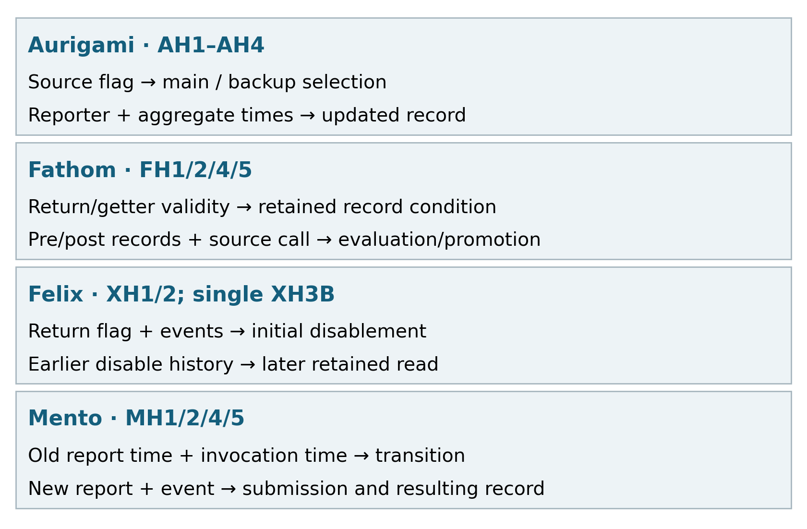
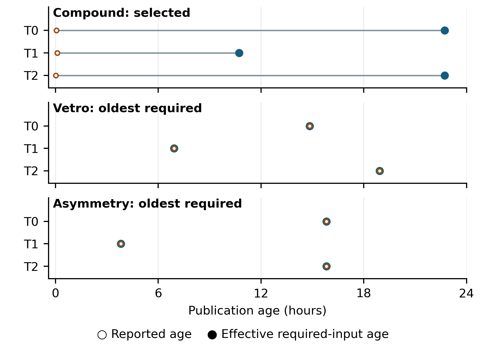
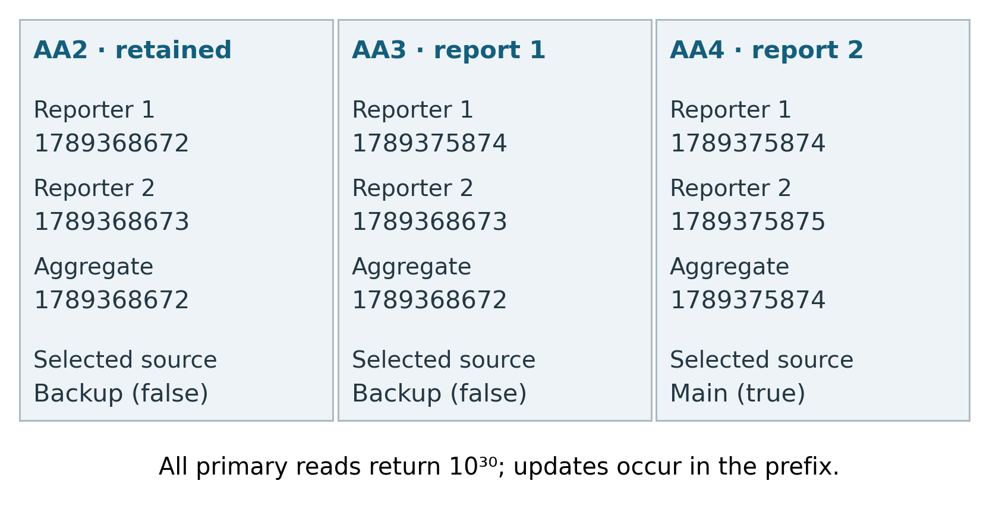
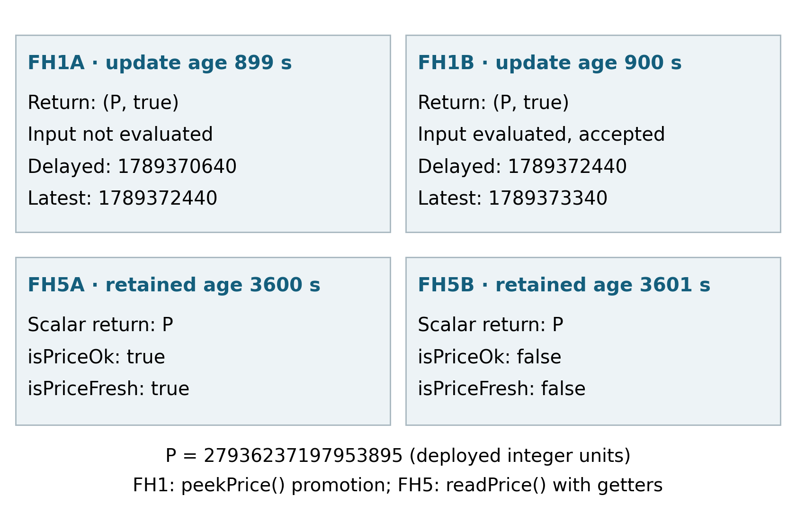

# Supplement S1: Evidence and extended methods

Tables and section numbers inside the preserved extended sections follow the V0.6 source. Main-manuscript Tables 1–2 are separate. The four sections A–D below provide the complete evidence and comparison ledgers.

This companion accompanies *Interpreting Stateful and Composed DeFi Oracles: Public Fields, Update Histories, and Temporal Coverage*. The package README identifies the current governing evidence review and the exact files for each finding. Historical records retain their original classifications; the latest dispositions control scientific use.

## Extended study methods

## 3. Study Design and Evidence Qualification

The study uses three execution designs, each suited to a different interpretive question. Fixed historical observations establish timestamp propagation on composed paths. Controlled enforcement and stateful comparisons vary feed conditions and legal state histories to expose return and public-field contrasts. The subsequent five-implementation examination adds longer histories, changed values, and proposition-level evidence review. The results retain these designs separately while applying a common vocabulary to their observations.

### 3.1. Selection and architectural applicability

The initial qualification processed a fixed frame of 614 canonical EVM Lending/CDP protocols in a deterministic order. Qualification used source identity, deployment evidence, architecture, and temporal-interface requirements. Price outputs, timestamp outputs, and age-gap outcomes were excluded from the discovery decisions. This procedure provides an inspectable basis for the numeric selection.

The frame produced 102 qualified-family aggregate credits, including four numeric-multi families. Protocol and family records have separate grains, summarized in Table 2. The planned breadth requirement of 12 numeric families, ten protocols, and five chains was met only for chains: the corresponding observations were four, four, and five. The subsequent fixed numeric confirmation used those eligible paths with a bounded semantic-conformance objective.

Stateful selection followed the earlier results and used source, binding, reachability, and public-observation criteria before its formal outputs. The follow-up examination retained its declared conditions and recorded deviations during later evidence review. The studies consequently have distinct selection histories and denominators. Their common analytical unit is the bound execution and the proposition being explained.

| Evidence set | Unit and scope | Accounting used in this paper |
|---|---|---|
| Initial architectural frame | Protocol | 614: 48 qualified-contributing; 505 partial; 33 unresolved; 21 excluded; 7 other outcomes |
| Qualified-family aggregate | Family credit | 102: 4 numeric-multi; 56 numeric-transform; 42 representation-only |
| Policy qualification ledger | Policy-family credit | 32 architecture; 10 complete |
| Fixed numeric observations | Root × snapshot | 6 roots × 3 snapshots = 18; 9 readable; 9 contract reverts |
| Earlier controlled enforcement | Path-scenario | 28: 25 unchanged compatible; 1 classifier-corrected; 2 non-comparable |
| Earlier stateful comparison | Condition / declared pair | 27 / 21 planned; 20 / 15 evaluable |
| Follow-up examination | Condition / declared comparison | 50 / 25 attempted; 40 / 18 design-matched; 33 / 15 fully evidence-qualified |

**Table 2. Evidence grains and study accounting.** Family and policy credits follow their respective registries. The two sets containing 15 comparisons are separate studies. Setup calls, getters, traces, and repeated snapshots retain their own roles rather than increasing the implementation count. Detailed qualification records are linked in Appendix A.

### 3.2. Controlled execution and legal histories

The controlled studies execute bound target implementations on historical forks. Inputs and dependency responses vary to establish age boundaries, call failures, and declared value histories. Target cache and status state are established through normal target calls. The records preserve the prefix, primary invocation, public observations, and execution trace separately.

The primary call's position in this sequence is essential. Fathom's `peekPrice()` can promote records, so its designated invocation is the intervention itself. Observation collection uses the saved execution and non-mutating getters. Aurigami reads occur after reporter updates, allowing the report-processing stage to be distinguished from source selection during the read. Mento's primary invocation is a report submission; its success acknowledgment is interpreted as an update operation. Felix's prefix can establish terminal state before a later retained-price read.

The earlier stateful study fixed 27 conditions and 21 pairs across Vesta, Aurigami, and Fathom. It obtained 20 valid executions: eight for Vesta, eight for Aurigami, and four for Fathom. Seven Fathom conditions retained historical-state infrastructure failures. Their six affected pairs remain outside the evaluable set. The follow-up used five implementations and 25 two-condition episodes. All 50 designated calls completed, and the subsequent qualification assessed both execution fidelity and the evidence supporting each semantic proposition.

### 3.3. Independent support for the explanation

An explanation is supported by the bound source branch together with concrete execution evidence. The intended intervention specifies what was attempted. Public records establish observed values and states. Trace evidence establishes particular internal actions when needed, such as Fathom's source-retrieval call. Storage writes are attributed to their execution context before they support an update claim. A dependency's storage operation has a different role from a target-cache update.

The follow-up review applies two filters. First, the actual condition must match its declared design. Second, the applicable semantic labels must have sufficient source and execution support. This yields 40 design-matched conditions, of which 33 have all nontrivial labels qualified. At comparison grain, both endpoints must qualify: 18 comparisons match design and 15 have complete evidence. The latter comprise four Aurigami, four Fathom, four Mento, and three Felix comparisons. Three additional qualified conditions have an unqualified partner and support individual execution descriptions.

The seven remaining design-matched conditions are Vesta cases. Their implementation metadata and public observations are retained, while locally saved, line-addressable source-body evidence is incomplete for three semantic propositions per condition. They therefore contribute public execution facts at the appropriate scope. The main follow-up findings use the four implementations with fully qualified conditions.

The offline review also identified seven differences from the reference-label records retained by the original analysis. Four accompanied a Vesta design deviation, and three corrected Fathom's input-evaluation or transition labels. Retrospective interpreter results and their rule revisions are documented in Appendix B. The empirical findings here use the reviewed witnesses and their specific evidence locators. The first author reviewed the evidence labels and all seven corrections against the retained source and execution records. Independent inter-rater agreement was not assessed.

### 3.4. Fixed blocks, references, and the controlled domain

The numeric schedule used three target times: 11 September 2026 at 13:00 UTC, 12 September at 01:00 UTC, and 12 September at 13:00 UTC. For each chain, the highest finalized block at or before the scheduled time defined the observation. The root and its required inputs were read at that block, and the block timestamp enters the age equations. The bindings include feed identities, composition formulas, decimal scaling, and integer-rounding behavior. Numeric qualification required multiple dynamic contributors and usable temporal representations. Unavailable or sentinel timestamps yield an undefined comparison and remain missing observations.

The earlier enforcement experiment used Ethereum block 25,961,491 for Secured Finance and Arbitrum block 504,401,544 for Nerite and Vesta. External-feed responses were controlled while target bytecode and target-maintained cache/status logic executed on the historical fork. Each Secured Finance and Nerite path had eight scenarios: fresh inputs, threshold-minus-one/equality/plus-one for each feed with the other feed fresh, and both age limits exceeded. The twelve Vesta entries covered age conditions, feed-call failures, and a state-establishment and continuation sequence. A scenario could contain more than one invocation, so the 28 entries count path-scenarios.

For that comparison, \(D\) is the observed action, \(F\) evaluates the applicable current-input predicates, and \(R\) describes allowed actions under the bound configuration and pre-state. A typical input predicate combines call success, response validity, and a configured age comparator. For determinate input evidence, \(F=\bigwedge_i\phi_i(q_i,t,c)\), where \(q_i\) is the current response and \(c\) the path configuration. The expected action can depend on both \(F\) and retained state. Independence concerns the separation of observed execution from its expected interpretation: a deployed return is evaluated against the reference rather than used to construct that reference.

Successful controlled responses kept positive answers, decimal structure, and round relationships fixed within the earlier path scenarios. The Vesta comparison used equal current/previous answers. This defines a domain in which the tested age and call-failure branches can be read against the recorded observations. The complete scenario accounting and its later binding correction are preserved in Appendix C.

### 3.5. Implementations, histories, and comparison construction

The earlier stateful selection assessed eight candidate dossiers before choosing Vesta, Aurigami, and Fathom. Existing policy records supplied the initial candidates; binding and reachability checks determined which histories could be established through target calls. Mento's single-reporter configuration was excluded from that particular design before execution. It entered the later examination under a different, report-transition question. This change in analytical role is recorded with the separate study selection.

The selected architectures expose different organizations of state. Vesta retains component values and an explicit status. Aurigami retains reporter and aggregate records and selects main or backup at read time. Fathom retains delayed/latest price records, update clocks, and validity conditions. Mento retains reporter rates and submission times. Felix adds a terminal-disable branch with a retained last-good value. Their exact root, anchor, and entrypoint information is summarized in Appendix C, with executable-source evidence linked to the binding dossiers.

Histories were constructed using the operations of each implementation. Authorized reporter submissions established Aurigami's records. Fathom's bound source was advanced through its normal update operations before delayed-feed invocations. Mento used authorized reports. Felix used healthy calls to establish the retained price and a controlled failure to reach disablement. Target storage was produced by these calls. Source-lineage judgments use inspected public origins and inheritance: the Felix/Vesta relationship remains a shared Liquity-derived ancestry, while other comparisons retain the bounded public-provenance qualification of their dossiers.

The later design contained five two-condition episodes per implementation. Declared factors included age boundaries, failure causes, changed values, longer legal prefixes, and shifts in absolute time. Conditions aimed at equal and unequal returns complemented stability comparisons. The implemented condition was then checked against its declaration, preserving the distinction between an executable call and a faithful experimental contrast. Table D1 lists all 25 planned comparisons and their final disposition, including the qualified individual endpoints whose partners deviated.

### 3.6. Observation windows and evidence roles

Each designated invocation has a public observation window before it and another after it, before a subsequent target mutation. An updating prefix is associated with the condition that uses the resulting state. For Aurigami, its reporter events precede the read-only `getUnderlyingPrice` call. Fathom's `peekPrice()` is called once as the designated intervention; its additional fields are obtained from the saved execution and read-only getters. This arrangement keeps the returned tuple and the observed state attached to the same invocation.

The earlier O2 normalization retains ordered event signatures, indexed topics and data, public cache/record fields, configuration and source indicators. Its O3 collection records opcodes with stack, memory and storage recording disabled and an empty enumerated nonpublic-state set. The later examination records additional trace detail used in the proposition review. These two trace collections have different capabilities and keep distinct identities.

The follow-up's public-history review includes saved setup/prefix receipts as well as primary-call logs. This matters for terminal reads: a quiet later call can inherit a state established by a publicly recorded earlier event. Scheduled fault values, condition names, and harness annotations describe intervention intent. They are kept separate from evidence that the target actually evaluated an input or changed a particular record. For Fathom, the review locates the `retrivePrice()` self-call in the trace. For Felix, it attributes writes to the correct target or dependency context.

Three evidence levels are used throughout the results. Returns, getter values and receipt records supply direct observations. Exact arithmetic and corrected decoding supply derived results. Bound source branches connect those observations to semantic propositions. The retained prospective pair labels describe the earlier design, while the follow-up's qualified explanations incorporate the later offline review. Appendix B documents the reference and rule corrections at that transition.

### 3.7. Analysis questions

The analysis answers three questions:

- **RQ1:** Which public fields and execution histories distinguish the source, update stage, and state associated with oracle observations?
- **RQ2:** How do these field-to-semantics relationships vary across the studied stateful implementations and declared history contrasts?
- **RQ3:** What temporal coverage do propagated timestamps provide on the fixed readable composition paths?

Sections 4 and 5 answer RQ1 and RQ2 through mechanism-centered comparisons. Section 6 answers RQ3 through the required-input timestamp relations. Each result combines a concrete observation, its supporting mechanism, and its interpretive consequence.

## Extended comparison tables and enforcement context

## 5. Cross-Implementation Synthesis

### 5.1. Each interface distributes its explanation differently

The stateful findings identify several ways to expose the meaning of an output. Aurigami places source identity in a public flag and update-stage context in reporter and aggregate records. Fathom associates validity with a returned Boolean or a separate getter, while record timestamps explain promotion. Felix exposes initial disablement through the full return and events, with later reads interpreted through the established history. Mento exposes submission and revalidation through report records and invocation timing.

| Implementation | Question addressed | Evidence carrying the explanation | Representative qualified witness |
|---|---|---|---|
| Aurigami | Which source is selected for an equal price? | Public source flag, aggregate and reporter records | AH1, AH2, AH4 |
| Aurigami | Which timestamp advanced? | Separate reporter and aggregate timestamps | AH3 |
| Fathom | Did this valid return evaluate an input? | Pre/post delayed/latest records and source-call evidence | FH1 |
| Fathom | Which retained record is returned and is it valid? | Delayed/latest values, timestamps, validity getters | FH2, FH4, FH5 |
| Felix | Did this invocation disable the path or read an already retained value? | Complete return, disable events, prefix history, contextualized writes | XH1, XH2; individual XH3B |
| Mento | Did a report refresh or revalidate the record? | Previous report timestamp, invocation time, updated record and events | MH1, MH2, MH4 |

**Table 5. Field-to-semantics relationships across qualified follow-up cases.** Evidence combinations support the named propositions. Each row names the proposition and the observations supporting its interpretation.

The shared result is a separation of interpretive dimensions. Price equality, source equality, update-stage equality, and transition equality each require their own evidence. The deployments differ in where that evidence resides. This variation is the basis for cross-implementation characterization: the same analytical questions lead to different useful fields and different history requirements.

### 5.2. Equality contrasts and controls serve different purposes

The earlier stateful matrix contains 15 evaluable declared pairs. Its retained reference ledger assigns different semantic labels to thirteen pairs, including eleven equal-return pairs and two non-collision pairs; two are same-reference controls. All eleven return-collision pairs differ in collected public context. The public tuples separate all 20 valid records, so the collected trace layer adds no further pair separation in that finite matrix. These observation-level comparisons provide context for the proposition-qualified follow-up.

The follow-up adds proposition-specific explanations and more varied histories. Its 15 fully qualified planned comparisons include equal returns with different source or update behavior, changed returns with the same categorical operation, and stability controls. AH3 and FH4 are particularly useful: timestamps change while the categorical source and transition labels agree. They show how a record-level difference can be meaningful without creating a new state-machine class.

The two analyses therefore answer related questions at different resolutions. Pair comparisons locate observable distinctions. Source and witness analysis explain what those distinctions mean. A public tuple can uniquely identify a collected record because a timestamp differs; the explanatory result is the supported relation between that timestamp and a reporter, aggregate, delayed window, or submission event.

### 5.3. Complementary enforcement examples

The earlier controlled enforcement study contributes additional action context. Under its tested rejected-input conditions, Secured Finance reverts, while Nerite returns a last-good value with a failure signal and source-state change. Vesta supplies retained public return and status sequences, including equal numeric returns across observed status changes. These observations complement the detailed source-grounded mechanisms in Section 4.

The complete earlier accounting is 28 path-scenarios: 25 unchanged compatible classifications, one action-classifier correction, and two cases rendered non-comparable by reference binding. Its purpose here is to locate the variety of exposed actions. For Vesta, the current source-evidence qualification in Section 3.3 governs further semantic use. The earlier records and correction trail remain available alongside the fully qualified follow-up results.

Secured Finance's two tested feed limits are 86,700 and 3,900 seconds, including the configured buffer. The root returns the current product at equality and reverts when the first input reaches 86,701 seconds or the second reaches 3,901 seconds. SF03, SF06, and SF07 expose rejection through a stale-feed revert. This is an action-level expression of the two input predicates at the bound product path.

Nerite uses a strict 90,000-second threshold in the tested domain. NE02, NE03, NE05, NE06, and NE07 return the pre-call `lastGoodPrice` with a true failure flag, retain that value, and change `priceSource` from 0 to 2. Fresh and threshold-minus-one cases return the current product with a false flag and update the last-good record. Thus, both the strictness of the comparator and the placement of the failure signal affect the meaning of the observed price. These records supply a whole-value retained-return contrast alongside Aurigami's alternative source and Fathom's delayed record.

The retained Vesta sequence supplies a direct public-state witness. VE10.1, VE10.2, and VE11 each return \(10^{18}\), while the recorded status follows 0→0→1→0 across the established state and subsequent calls. A separate anchor-history case, VE08, returns \(32.1\times10^{18}\) under the controlled price-call failure, while VE10.2 returns \(10^{18}\) after a successful prefix established that lower cache value. The returns and status readings document value stability across state changes and value differences across histories. Their more detailed source-leg interpretations remain with the qualified source-binding records, as described in Appendix B.

| Path and cases | Controlled condition | Observed return and public context | Explanatory role |
|---|---|---|---|
| Secured Finance SF03/06/07 | One or both configured age limits exceeded | Stale-feed revert | Rejection is expressed through the call outcome |
| Nerite NE02/03/05/06/07 | One or both strict age predicates fail | Last-good price; flag true; `priceSource` 0→2 | A retained number and an explicit failure signal coexist |
| Vesta VE10.1→VE10.2→VE11 | Established cache, price-call failure, restored inputs | Equal numeric return; public status 0→0→1→0 | Output stability coexists with observed state change |
| Felix XH1/XH2 | Age rejection or oracle-call failure | Same price component; flag false→true; disable events | The complete return expresses the initial transition |

**Table 6. Complementary enforcement observations.** The rows retain their respective predicates, entrypoints and study identities. Vesta's row reports the directly retained numeric and public-status observations. All earlier scenario classifications, including the two non-comparable cases, appear in Table C2.

**Figure 3. Where the explanation resides on the studied paths.** Aurigami uses source and record fields, Fathom combines retained-record validity with promotion evidence, Felix combines a complete return signal with the relevant event prefix, and Mento combines report records with invocation time. The figure maps fields to questions; each row points to its corresponding witnesses in Section 4.

## Complete temporal table and provenance

## 6. Temporal Coverage on Composed Paths

### 6.1. Selected-constituent propagation

The Compound path computes a composed value while propagating a selected constituent's timestamp. Its source prediction and the required-input bindings determine which publication the top-level field represents. At the three fixed snapshots, reported ages are 196, 352, and 58 seconds, while the corresponding oldest-required ages are 81,798, 38,580, and 81,780 seconds. The signed differences are 81,602, 38,228, and 81,722 seconds.

These observations make the coverage distinction concrete. A recent selected constituent supplies a recent top-level timestamp while another required publication is older. The value computation and propagated timestamp follow their respective rules. Correct interpretation assigns the top-level timestamp to the constituent it covers and uses the required-input set for the oldest-publication question.

### 6.2. Oldest-required propagation

Vetro and Asymmetry instead propagate the oldest required timestamp. Each yields three readable observations with zero signed gap. Their absolute ages vary across snapshots, but reported and effective age agree at every readable observation.

The equality induced by a minimum-timestamp rule follows algebraically. The empirical contribution is the deployment binding, source prediction, and execution conformance that establish this rule on the selected roots. Together with Compound, the results identify two concrete meanings of a top-level timestamp exposed along composed paths.

Binding precedes this calculation. The reader must identify the required dynamic inputs, verify their scale in the root formula, and determine whether the returned timestamp is selected or reduced across those inputs. Formula replay tests the value relation with the same block's inputs, while timestamp prediction tests the temporal relation. These checks distinguish a mathematically possible propagation rule from the rule instantiated by the selected deployment. They also retain failed reads as missing numeric observations, as shown for all three selected Silo roots in Table 7.

**Figure 4. Timestamp coverage and fixed execution observations.** Compound propagates the selected constituent timestamp; Vetro and Asymmetry propagate the minimum required timestamp. Each plotted pair uses the same block's reported and effective publication ages. The table retains primary, recovery, and corrected-analysis evidence tiers. Table 7 includes the nine additional planned observations whose calls reverted.

| Family / root group | Snapshot | Reported age (s) | Effective age (s) | Signed gap (s) | Evidence status |
|---|---|---:|---:|---:|---|
| Compound | T0 | 196 | 81,798 | 81,602 | Primary |
| Compound | T1 | 352 | 38,580 | 38,228 | Primary |
| Compound | T2 | 58 | 81,780 | 81,722 | Formula replay corrected from existing inputs |
| Vetro | T0 | 53,412 | 53,412 | 0 | Secondary infrastructure recovery |
| Vetro | T1 | 24,912 | 24,912 | 0 | Secondary infrastructure recovery |
| Vetro | T2 | 68,112 | 68,112 | 0 | Primary |
| Asymmetry | T0 | 56,940 | 56,940 | 0 | Secondary infrastructure recovery |
| Asymmetry | T1 | 13,716 | 13,716 | 0 | Secondary infrastructure recovery |
| Asymmetry | T2 | 56,916 | 56,916 | 0 | Primary |
| Silo, Sonic root | T0 | NA | NA | NA | Contract revert |
| Silo, Sonic root | T1 | NA | NA | NA | Contract revert |
| Silo, Sonic root | T2 | NA | NA | NA | Contract revert |
| Silo, Arbitrum root | T0 | NA | NA | NA | Contract revert |
| Silo, Arbitrum root | T1 | NA | NA | NA | Contract revert |
| Silo, Arbitrum root | T2 | NA | NA | NA | Contract revert |
| Silo, Avalanche root | T0 | NA | NA | NA | Contract revert |
| Silo, Avalanche root | T1 | NA | NA | NA | Contract revert |
| Silo, Avalanche root | T2 | NA | NA | NA | Contract revert |

**Table 7. All 18 planned numeric observations.** Formula replay and timestamp prediction match for the nine readable observations after the disclosed Compound T2 analysis correction. Four rows retain recovery provenance. Silo's selected roots reverted under the planned calls and contribute the nine nonnumeric records. Exact identities and row locators accompany the table in Appendix A.

### 6.3. Temporal metadata as a specific explanation

The numeric and stateful findings meet at the interpretation of a field. In the numeric paths, source binding identifies the publication represented by a propagated timestamp. In Aurigami and Fathom, timestamped public records locate the aggregate or retained stage represented by an observation. In Mento, the report time identifies a submission and supports expiry reasoning at a later invocation. Each use asks the same first question: which event or record generated this time?

The experiments establish these relationships on their respective paths. The temporal study supplies a controlled definition of required-input coverage; the stateful cases supply source and history context for returned observations. Their synthesis is an empirical account of interpretation across mechanisms.

## Appendix A. Evidence Guide

### A.1. Main result locators

| Manuscript result | Evidence location |
|---|---|
| All 18 numeric observations and row identities | [Numeric observation table](project/journal_manuscript_phase/JOURNAL_V0.4_REVIEWER_SUPPLEMENT/numeric_observation_table.csv) |
| Earlier stateful conditions and pairs | [Condition results](project/journal_manuscript_phase/JOURNAL_V0.4_REVIEWER_SUPPLEMENT/g7_condition_results.csv); [declared pair results](project/journal_manuscript_phase/JOURNAL_V0.4_REVIEWER_SUPPLEMENT/g7_predeclared_pair_results.csv) |
| Earlier public observations | [Normalized observations](project/journal_manuscript_phase/JOURNAL_V0.4_REVIEWER_SUPPLEMENT/normalized_observations.json) |
| Earlier 28 enforcement scenarios | [Complete original/derived classifications](project/journal_manuscript_phase/JOURNAL_V0.4_REVIEWER_SUPPLEMENT/policy_original_results.csv) |
| Follow-up condition fidelity | [50-condition fidelity ledger](project/semantic_explanation_validation_v1/08_targeted_offline_closure_addendum/ADDENDUM_CONDITION_FIDELITY.csv) |
| Follow-up proposition support | [250-row evidence audit](project/semantic_explanation_validation_v1/08_targeted_offline_closure_addendum/NONTRIVIAL_LABEL_EVIDENCE_AUDIT.csv) |
| Follow-up final denominators | [Final qualified denominator and disposition](project/semantic_explanation_validation_v1/08_targeted_offline_closure_addendum/FINAL_QUALIFIED_DENOMINATOR_AND_DISPOSITION.md) |
| Public/internal/harness distinction | [Observation evidence audit](project/semantic_explanation_validation_v1/08_targeted_offline_closure_addendum/PUBLIC_VS_HARNESS_EVIDENCE_AUDIT.md) |
| Exact Vesta evidence scope | [PriceFeedV2 source-binding audit](project/semantic_explanation_validation_v1/08_targeted_offline_closure_addendum/VESTA_PRICEFEEDV2_SOURCE_BINDING_AUDIT.md) |

The follow-up observations are retained under `semantic_explanation_validation_v1/03_execution/observations/<condition_id>.json`. The corresponding trace files, raw RPC records, and call ledger provide the lower-level evidence locators recorded by the proposition audit.

### A.2. Follow-up comparison accounting

| Implementation | Attempted conditions | Design-matched conditions | Fully qualified conditions | Fully qualified planned comparisons |
|---|---:|---:|---:|---|
| Vesta | 10 | 7 | 0 | 0 |
| Aurigami | 10 | 8 | 8 | 4: AH1, AH2, AH3, AH4 |
| Fathom | 10 | 9 | 9 | 4: FH1, FH2, FH4, FH5 |
| Mento | 10 | 9 | 9 | 4: MH1, MH2, MH4, MH5 |
| Felix | 10 | 7 | 7 | 3: XH1, XH2, XH5 |
| Total | 50 | 40 | 33 | 15 |

**Table A1. Final follow-up qualification.** Of the 25 planned comparisons, 18 have two design-matched endpoints. Three of those remain source-incomplete Vesta comparisons. FH3B, MH3B, and XH3B are qualified individual conditions outside the complete-pair denominator. Among 162 nontrivial labels on design-matched conditions, 141 have qualified support. These figures describe evidence qualification.

The ten design deviations are VH1B, VH4A, VH4B, AH5A, AH5B, FH3A, MH3A, XH3A, XH4A, and XH4B. AH5A/B actually selected main at the inclusive boundary; their recorded calls support that actual time-shifted main-path description. Their originally intended backup comparison is excluded.

### A.3. Screening detail

The [screening summary](project/journal_manuscript_phase/JOURNAL_V0.4_REVIEWER_SUPPLEMENT/screening_summary.md) preserves the protocol and family accounting behind Table 2. Policy-family credits follow a separate ledger, including control and boundary entries. The historical Top100 policy total contains one unresolved credit attribution: the explicit registry sums to 14 while the retained total is 15. That attribution remains unresolved in the supporting records.

## Appendix B. Analysis Corrections and Supporting Material

### B.1. Numeric and earlier enforcement corrections

Compound T2's original formula mismatch arose because the transport runner lacked the family-specific formula-replay branch. Recomputing the retained inputs gives

\[
\left\lfloor
\frac{1{,}138{,}880{,}907{,}015{,}225{,}000
\times253{,}375{,}200{,}000}{10^{18}}
\right\rfloor=288{,}564{,}177{,}591,
\]

equal to the root answer. The derived formula status is `MATCH_AFTER_ANALYSIS_CORRECTION`; timestamps and ages remain unchanged. The [correction record](project/journal_manuscript_phase/JOURNAL_V0.4_REVIEWER_SUPPLEMENT/corrections/compound_T2.md) and [recovery record](project/journal_manuscript_phase/JOURNAL_V0.4_REVIEWER_SUPPLEMENT/corrections/numeric_recovery.md) retain the numeric evidence tiers.

The earlier policy study preserves 25 original compatible records, VE10's `COMPATIBLE_AFTER_ACTION_CLASSIFIER_CORRECTION`, and VE06/VE07's `NOT_COMPARABLE_REFERENCE_BINDING_ERROR`. VE10 originally classified a numerically colliding action incorrectly; the derived correction used unchanged execution evidence. VE06/VE07 used a reference from a different Vesta source variant. Their original classifications and reference remain preserved in the [review](project/journal_manuscript_phase/JOURNAL_V0.4_REVIEWER_SUPPLEMENT/corrections/vesta_review.md). Their deployed returns remain observations, while their original obligation comparison is non-comparable.

The earlier stateful study also retains an offline return-decoding correction for duplicated hexadecimal prefixes. Legal ABI bytes in the saved RPC traces supply the corrected complete tuples, including Fathom's Boolean. The [decoding record](project/journal_manuscript_phase/JOURNAL_V0.4_REVIEWER_SUPPLEMENT/return_decoding_correction.md) identifies the original and derived fields.

### B.2. Follow-up label review and interpreter status

Compared with the reference-label records retained by the original analysis, the review found seven differences. Four arise in VH1B, whose executed age was 1 second and departed from its declared condition. FH1A and FH3A did not evaluate an input. FH3B was already invalid at the primary invocation's start, so its invocation did not cause a valid-to-invalid transition. The later condition review further excluded AH5A/B from their planned backup comparison, producing the final 40-condition fidelity denominator.

The original interpreter's zero-error assertion was withdrawn. Its 14 terminal-layer indeterminate tasks were classified as rule incompleteness, and its apparent 21-task advantage over public history depended on missing prefix/setup logs in that public baseline. Those logs were available among the retained receipts. Executable-rule provenance also limits the interpretation of prospective rule validation. Corrected rules and rescoring remain retrospective exploratory material in the [closure report](project/semantic_explanation_validation_v1/07_offline_correctness_closure_v1/OFFLINE_CORRECTNESS_CLOSURE_FINAL_REPORT.md) and [claim disposition](project/semantic_explanation_validation_v1/07_offline_correctness_closure_v1/CLAIM_DISPOSITION_MATRIX.md). The final addendum controls condition and proposition qualification.

### B.3. Historical retrieval and replay checks

Ten fixed historical windows yielded 39,978 Mento root-address events. Zero-log windows for the other four implementations were retained. These records document event retrieval under the specified query scope. The selected replay covered five of 25 episodes and 594 RPC projections, with 594 matching stable semantic projections. A separate replay implementation and clean process were used within the same research workflow. These supporting checks concern retrieval and transcript portability.

The earlier 116-instance synthetic policy workflow and the unavailable historical A/B materials remain project history outside the results used in this manuscript. Their status and the unsuccessful engineering attempts are preserved in the existing supporting records.

## Appendix C. Deployment Anchors and Complete Earlier Tables

### C.1. Bound identities

The following anchors identify the five implementations in the later examination. Root addresses, block hashes, implementation identities and source/runtime correspondence are retained together in the binding records. Entrypoints distinguish report updates, mutating fetches, and read-only reads.

**Table C1. Historical roots and designated entrypoints.** Blocks refer to the fork anchors. Later local invocation timestamps are recorded separately with the controlled history.

| Implementation | Chain ID / anchor block | Root | Designated entrypoint |
| --- | --- | --- | --- |
| VESTA | 42161 / 504401544 | 0xC93408bFBEa0Bf3E53bEdBce7D5C1e64db826702 | fetchPrice(address) |
| AURIGAMI | 1313161554 / 215607038 | 0xC6e5185438e1730959c1eF3551059A3feC744E90 | getUnderlyingPrice(address) |
| FATHOM | 50 / 107219710 | 0x5dE248bbD0ae9E846B8dBa12960fc3524Fb37a88 | peekPrice(); readPrice() |
| MENTO | 42220 / 77467895 | 0xefb84935239dacdecf7c5ba76d8de40b077b7b33 | report(...) |
| FELIX | 999 / 45864222 | 0x12a1868b89789900e413a6241ca9032dd1873a51 | fetchPrice() |

The Mento root binds implementation `0x93da60dcdda3229246769cce307076c181f41f72` and the selected feed `0x44D99a013a0DAdbB4C06F9Cc9397BFd3AC12b017`. Felix binds implementation `0x3e46a36debc92d845af452a6d5b3395acd21144e` and oracle `0xa8a94Da411425634e3Ed6C331a32ab4fd774aa43`. Vesta's metadata identifies PriceFeedV2 at `0x522808d93Ac229CEfc17c4BE0408520f7e27D26d`; its local source-body evidence has the qualification in Section 3.3. Fathom's executable-runtime/source correspondence excludes compiler metadata equality. Full identity records are in the [deployment ledger](project/semantic_explanation_validation_v1/01_protocol/deployments.json), the [earlier binding guide](project/journal_manuscript_phase/JOURNAL_V0.4_REVIEWER_SUPPLEMENT/deployment_binding_summary/README.md), and the [targeted source audit](project/semantic_explanation_validation_v1/08_targeted_offline_closure_addendum/VESTA_PRICEFEEDV2_SOURCE_BINDING_AUDIT.md).

### C.2. Earlier enforcement classifications

**Table C2. All 28 earlier path-scenarios.** Action columns reproduce the interpretations recorded by that study, preserving the original and derived classifications. C = compatible; I = incompatible; C* = compatible after action-classifier correction; NC = reference-binding non-comparability. Vesta action-source interpretations retain the current source-evidence qualification. Direct returns and public states used by this manuscript are identified in Section 5.3.

| Scenario | Retained F label | Recorded derived action interpretation | Original | Derived |
| --- | --- | --- | --- | --- |
| SF00 | true | return current product | C | C |
| SF01 | true | return current product | C | C |
| SF02 | true | return current product | C | C |
| SF03 | false | revert stale price feed | C | C |
| SF04 | true | return current product | C | C |
| SF05 | true | return current product | C | C |
| SF06 | false | revert stale price feed | C | C |
| SF07 | false | revert stale price feed | C | C |
| NE00 | true | return current product flag false | C | C |
| NE01 | true | return current product flag false | C | C |
| NE02 | false | return last good price flag true | C | C |
| NE03 | false | return last good price flag true | C | C |
| NE04 | true | return current product flag false | C | C |
| NE05 | false | return last good price flag true | C | C |
| NE06 | false | return last good price flag true | C | C |
| NE07 | false | return last good price flag true | C | C |
| VE00 | true | return current | C | C |
| VE01 | true | return current | C | C |
| VE02 | true | return current | C | C |
| VE03 | false | return mixed current cached | C | C |
| VE04 | true | return current | C | C |
| VE05 | true | return current | C | C |
| VE06 | false | return current | I | NC |
| VE07 | false | return mixed current cached | I | NC |
| VE08 | false | return mixed current cached | C | C |
| VE09 | false | return mixed current cached | C | C |
| VE10 | true → false | normal to degraded transition | I | C* |
| VE11 | true | degraded to recovery transition | C | C |

The two NC cases retain their original F labels as part of the analysis record. VE06/VE07 used a reference from another Vesta source variant, and their compatibility inference remains withdrawn. VE10 retains its original incompatible classification alongside the derived classifier correction. The totals are 25 unchanged C, one C*, and two NC. The [complete ledger](project/journal_manuscript_phase/JOURNAL_V0.4_REVIEWER_SUPPLEMENT/policy_original_results.csv) preserves the original action strings and allowed-reference fields.

### C.3. Earlier stateful conditions

**Table C3. All 27 earlier designated conditions.** Returns are the complete corrected ABI tuples derived from unchanged trace bytes. NA indicates unavailable execution evidence. This table exposes observation coverage independently of the current semantic-label qualification. Each listed available return has a corresponding row in the normalized observation record.

| Condition | Episode | Entrypoint | Complete primary return | Observation status |
| --- | --- | --- | --- | --- |
| VA0 | V_A | fetchPrice(gOHM) | (1000000000000000000) | Retained execution |
| VA1 | V_A | fetchPrice(gOHM) | (1000000000000000000) | Retained execution |
| VA2 | V_A | fetchPrice(gOHM) | (1000000000000000000) | Retained execution |
| VA3 | V_A | fetchPrice(gOHM) | (1000000000000000000) | Retained execution |
| VA4 | V_A | fetchPrice(gOHM) | (1000000000000000000) | Retained execution |
| VB0 | V_B | fetchPrice(gOHM) | (1200000000000000000) | Retained execution |
| VB1 | V_B | fetchPrice(gOHM) | (1200000000000000000) | Retained execution |
| VB2 | V_B | fetchPrice(gOHM) | (1000000000000000000) | Retained execution |
| AA0 | A_A | getUnderlyingPrice(auUSDC) | (1000000000000000000000000000000) | Retained execution |
| AA1 | A_A | getUnderlyingPrice(auUSDC) | (1000000000000000000000000000000) | Retained execution |
| AA2 | A_A | getUnderlyingPrice(auUSDC) | (1000000000000000000000000000000) | Retained execution |
| AA3 | A_A | getUnderlyingPrice(auUSDC) | (1000000000000000000000000000000) | Retained execution |
| AA4 | A_A | getUnderlyingPrice(auUSDC) | (1000000000000000000000000000000) | Retained execution |
| AB0 | A_B | getUnderlyingPrice(auUSDC) | (1200000000000000000000000000000) | Retained execution |
| AB1 | A_B | getUnderlyingPrice(auUSDC) | (1000000000000000000000000000000) | Retained execution |
| AB2 | A_B | getUnderlyingPrice(auUSDC) | (1000000000000000000000000000000) | Retained execution |
| FA0 | F_A | peekPrice() | NA | Technical missingness |
| FA1 | F_A | peekPrice() | NA | Technical missingness |
| FA2 | F_A | peekPrice() | NA | Technical missingness |
| FA3 | F_A | peekPrice() | NA | Technical missingness |
| FB0 | F_B | peekPrice() | NA | Technical missingness |
| FB1 | F_B | peekPrice() | NA | Technical missingness |
| FB2 | F_B | peekPrice() | NA | Technical missingness |
| FC0 | F_C | peekPrice() | (27936237197953895, true) | Retained execution |
| FC1 | F_C | peekPrice() | (27936237197953895, true) | Retained execution |
| FC2 | F_C | readPrice() | (27936237197953895) | Retained execution |
| FC3 | F_C | readPrice() | (27936237197953895) | Retained execution |

FA0–FA3 and FB0–FB2 retain historical-state/rate-limit and inherited-history failures. FC0–FC3 belong to a separately initialized boundary episode. Vesta's public status and cache observations remain in the normalized records; richer source interpretations follow the current qualification. The unchanged raw bytes and the original duplicate-prefix decoding fields are retained with the correction in Appendix B.

### C.4. Earlier declared pair coverage

**Table C4. All 21 earlier pairs.** The Y relation is the retained design-reference relation. Equality columns describe the saved complete return and normalized public tuples. Available public tuples differ for all 15 evaluable pairs, and the collected O3 adds zero further splits. Unavailable pairs retain their declared endpoints.

| Pair | Endpoints | Retained reference relation | O1 | O2 | Status |
| --- | --- | --- | --- | --- | --- |
| PV01 | VA1/VA2 | different | Equal | Different | Evaluable |
| PV02 | VA0/VA2 | different | Equal | Different | Evaluable |
| PV03 | VA2/VA3 | different | Equal | Different | Evaluable |
| PV04 | VA2/VA4 | different | Equal | Different | Evaluable |
| PV05 | VB1/VB2 | different | Different | Different | Evaluable |
| PV06 | VA2/VB1 | same enum different prehistory | Different | Different | Evaluable |
| PA01 | AA1/AA2 | different | Equal | Different | Evaluable |
| PA02 | AA0/AA2 | different | Equal | Different | Evaluable |
| PA03 | AA2/AA3 | different | Equal | Different | Evaluable |
| PA04 | AA3/AA4 | different | Equal | Different | Evaluable |
| PA05 | AB0/AB1 | different | Different | Different | Evaluable |
| PA06 | AB1/AB2 | different | Equal | Different | Evaluable |
| PA07 | AA2/AB1 | same | Equal | Different | Evaluable |
| PF01 | FA0/FA1 | same | NA | NA | Technical missingness |
| PF02 | FA1/FA2 | different | NA | NA | Technical missingness |
| PF03 | FA2/FA3 | different | NA | NA | Technical missingness |
| PF04 | FB0/FB1 | different | NA | NA | Technical missingness |
| PF05 | FB1/FB2 | different | NA | NA | Technical missingness |
| PF06 | FC0/FC1 | different | Equal | Different | Evaluable |
| PF07 | FC2/FC3 | different | Equal | Different | Evaluable |
| PF08 | FA1/FB1 | different | NA | NA | Technical missingness |

PV05 and PA05 are the non-collision controls. PV06 and PA07 retain the same categorical reference relation with different histories or records. PV03's different prior statuses explain why its public separation is specific to those histories. The [field-to-contrast table](project/journal_manuscript_phase/JOURNAL_V0.4_REVIEWER_SUPPLEMENT/g7_field_to_contrast_table.csv) supplies literal getter values and pointers for each evaluable pair. The newer proposition qualification is reported separately in Appendix D.

## Appendix D. Complete Follow-Up Comparison Coverage

**Table D1. All 25 planned two-condition comparisons.** A/B identify the declared endpoint conditions. Qualified means that the endpoint matches its design and all applicable nontrivial propositions have evidence support. Source-incomplete marks a design-matched Vesta endpoint with unresolved exact-source evidence. Deviation marks an actual condition different from the declared design. A qualified individual endpoint remains usable at that grain even when its pair is excluded.

| Episode | Declared A / B factors | A | B | Final comparison disposition |
| --- | --- | --- | --- | --- |
| VH1 | age theta minus 1 / age theta plus 1 | Source-incomplete | Deviation | Excluded from planned comparisons |
| VH2 | age rejection from shared snapshot / call failure from shared snapshot | Source-incomplete | Source-incomplete | Design-matched; source-incomplete |
| VH3 | retained H / current K | Source-incomplete | Source-incomplete | Design-matched; source-incomplete |
| VH4 | long prefix untrusted / long prefix revalidated | Deviation | Deviation | Excluded from planned comparisons |
| VH5 | nuisance time a / nuisance time b | Source-incomplete | Source-incomplete | Design-matched; source-incomplete |
| AH1 | updater 2 then 1 first / aggregate completed | Qualified | Qualified | Qualified planned comparison |
| AH2 | age theta / age theta plus 1 | Qualified | Qualified | Qualified planned comparison |
| AH3 | raw only / aggregate refresh | Qualified | Qualified | Qualified planned comparison |
| AH4 | three reporter prefix / main expired after long prefix | Qualified | Qualified | Qualified planned comparison |
| AH5 | backup nuisance time a / backup nuisance time b | Deviation | Deviation | Excluded from planned comparisons |
| FH1 | delay 899 / delay 900 | Qualified | Qualified | Qualified planned comparison |
| FH2 | latest changed delayed retained / delayed promoted | Qualified | Qualified | Qualified planned comparison |
| FH3 | source success shared prestate / source error shared prestate | Deviation | Qualified | Excluded from planned comparisons |
| FH4 | equal value promotion 3 / equal value promotion 4 | Qualified | Qualified | Qualified planned comparison |
| FH5 | retained age 3600 / retained age 3601 | Qualified | Qualified | Qualified planned comparison |
| MH1 | report age 359 / report age 361 | Qualified | Qualified | Qualified planned comparison |
| MH2 | expired invalid / new report revalidated | Qualified | Qualified | Qualified planned comparison |
| MH3 | equivalent rate old timestamp / equivalent rate new timestamp | Deviation | Qualified | Excluded from planned comparisons |
| MH4 | long history fresh / long history expired | Qualified | Qualified | Qualified planned comparison |
| MH5 | nuisance time a / nuisance time b | Qualified | Qualified | Qualified planned comparison |
| XH1 | healthy / stale disable | Qualified | Qualified | Qualified planned comparison |
| XH2 | healthy shared prestate / revert disable shared prestate | Qualified | Qualified | Qualified planned comparison |
| XH3 | terminal cached first / terminal cached repeat | Deviation | Qualified | Excluded from planned comparisons |
| XH4 | healthy noncollision / cached noncollision | Deviation | Deviation | Excluded from planned comparisons |
| XH5 | nuisance time a / nuisance time b | Qualified | Qualified | Qualified planned comparison |

This table yields 18 design-matched comparisons, including 15 with fully qualified evidence. At condition grain, 40 match design and 33 are fully qualified. The remaining qualified single endpoints are FH3B, MH3B, and XH3B. The full 50-condition record includes actual interventions and their locators in the [condition audit](project/semantic_explanation_validation_v1/08_targeted_offline_closure_addendum/ADDENDUM_CONDITION_FIDELITY.csv); all 250 proposition rows remain in the [evidence-support table](project/semantic_explanation_validation_v1/08_targeted_offline_closure_addendum/NONTRIVIAL_LABEL_EVIDENCE_AUDIT.csv).

The comparison list preserves controls along with changing-state cases. AH3 and FH4 examine timestamped records within stable categorical interpretations; MH5 and XH5 retain time-shift stability. The excluded pairs remain visible beside the qualified cases, and their actual execution records are retained at the narrower descriptive scope specified by the audit.

## Retained complete stateful comparison text

## 4. Stateful Findings

### 4.1. Reporter acceptance, aggregate advancement, and source selection are distinct stages

Aurigami provides the clearest staged example. In the earlier controlled sequence, one authorized report is accepted while the aggregate remains old and the read continues to select backup. A later qualifying update refreshes the aggregate and the read selects main. The primary returned price remains equal across the sequence. Reporter records and update events explain the processing history, while the public source indicator explains the selection at read time.

The sequence AA2–AA4 makes the intermediate stage observable. AA2 begins with an expired aggregate and selects backup. The AA3 prefix accepts a new reporter-1 record at timestamp 1,789,375,874. Reporter 2 remains at 1,789,368,673, and aggregate time remains 1,789,368,672. The prefix emits `MainFeedFail`, and the following read returns \(10^{30}\) with `isFromMainFeed=false`. The accepted raw record and unchanged aggregate give the event its stage-specific interpretation: report reception succeeded while the aggregation step retained the older record.

In AA4, the reporter-2 timestamp advances to 1,789,375,875, aggregate time advances to 1,789,375,874, and the prefix emits `MainFeedSync`. The read now reports `isFromMainFeed=true` while returning the same \(10^{30}\). Figure 1 places the raw records, aggregate record, and selected source beside one another. Their joint change identifies how the second report enables main selection. The public source indicator is a named return field of `_getRawUnderlyingPrice`, and the reporter/aggregate updates belong to the authorized prefix calls.

**Figure 1. Reporter acceptance, aggregate refresh, and read-time selection in the earlier AA2–AA4 sequence.** Timestamps are seconds. All three primary reads return \(10^{30}\). The first accepted update advances reporter 1 while the aggregate and backup selection remain unchanged; the second advances the aggregate and enables main selection. Values are preserved from the earlier field-to-contrast evidence.

The qualified follow-up comparisons reproduce and refine this distinction. AH1 reverses the authorized updater order. After the first update, the primary return is \(0.91\times10^{30}\), and the public `rawUnderlying` source flag is false. After aggregate completion, the return remains \(0.91\times10^{30}\), and the flag becomes true. The bound semantics associate these flags with backup and main selection. Thus, the same numeric result accompanies a change in selected source that is directly represented in another public field.

AH2 isolates the age predicate. With a 7,200-second validity period, the read selects main at the boundary and backup one second later. Both return \(1.07\times10^{30}\). The source flag changes even though the stored aggregate remains equal. This is read-time selection over persisted data: the read's `updated_stage` and `state_transition` labels are both `NONE`.

AH3 exposes a subtler distinction between reporter time and aggregate time. After a reporter update, reporter 1 has timestamp 1,789,368,672, while reporter 2 and the aggregate retain timestamp 1,789,368,670. After the subsequent update, reporter 2 reaches 1,789,368,673 and aggregate time advances to 1,789,368,672. Both primary reads return \(1.31\times10^{30}\) from main. These fields locate freshness at different stages of the aggregation process. The first timestamp advance describes a reporter record; the later advance describes the aggregate's temporal state.

| Comparison | Stable primary observation | Distinguishing public evidence | Interpretation |
|---|---|---|---|
| AH1A / AH1B | \(0.91\times10^{30}\) | Source flag false / true; reporter and aggregate records | Backup selection / main selection after the update prefix |
| AH2A / AH2B | \(1.07\times10^{30}\) | Source flag true / false at 7,200 / 7,201 s | Main / backup selected from the same retained aggregate |
| AH3A / AH3B | \(1.31\times10^{30}\), main selected | Aggregate time 1,789,368,670 / 1,789,368,672 | Equal values with different aggregate publication state |
| AH4A / AH4B | \(0.91\times10^{30}\) | Source flag true / false after the longer reporter prefix | The same selection contrast under a three-reporter history |

**Table 3. Aurigami's four qualified planned comparisons.** Numeric values are the actual consumer-scaled returns. Reporter and aggregate updates occur in the prefix; the primary reads make no persistent transition. AH3 supports timestamp advancement and stage interpretation even though its reviewed categorical labels agree.

Together, these cases show why an accepted report, a newer raw timestamp, and a main-source read answer different questions. Aurigami's public interface exposes the distinctions through the combination of reporter records, aggregate time, and the source flag. A reader can explain the observed output by following the stages in that order.

The two sequences also distinguish aggregate persistence from aggregate timestamp persistence. In AA3, the old aggregate record remains in place because the other required report is too old. In AH3, main remains selected and the aggregate time is constrained by the older reporter timestamp even after a newer raw timestamp appears. Their shared explanatory structure is the separation of processing stages, while their concrete retained records and eligibility circumstances differ. Reporting both avoids treating every raw update with an unchanged aggregate timestamp as the same execution branch.

### 4.2. Retained-value validity and current input evaluation follow different conditions

Fathom's delayed feed separates when a record is returned, when a source is evaluated, and when records advance. FH1 places `peekPrice()` on either side of its 900-second update boundary. At 899 seconds, the call returns the delayed price with `true`, and the records remain unchanged. At 900 seconds, the source is evaluated and the delayed/latest records advance. The returned tuple is identical: `(27936237197953895, true)`.

The public record timestamps locate this change. The delayed timestamp advances from 1,789,370,640 to 1,789,372,440, and the latest timestamp advances to 1,789,373,340. The retained trace confirms the `retrivePrice()` self-call on the updating execution. The first invocation's `true` expresses the validity of the retained result. The second invocation additionally evaluates and accepts a source response. The complete return tuple therefore has a stable value and validity flag across different input-evaluation and update actions.

FH2 makes delayed provenance visible through a changing price. The first invocation returns 27,936,237,197,953,895 while storing 27,422,056,278,282,322 as the latest value. The later invocation promotes that latest record and returns 27,422,056,278,282,322. Both invocations change the observed validity from false to true and update delayed/latest records. Their numeric difference follows which source window has reached the delayed stage.

The equal-value promotions in FH4 complement this contrast. Successive promotions keep the returned tuple equal while delayed and latest timestamps advance. FH5 then isolates record validity through scalar `readPrice()` calls. The scalar is equal at retained ages 3,600 and 3,601 seconds; the separate `isPriceOk` and `isPriceFresh` getters change from true to false. Both scalar reads leave state unchanged and do not evaluate a source.

| Comparison | Return behavior | Additional evidence | Explained distinction |
|---|---|---|---|
| FH1A / FH1B | Same `(price, true)` | Record timestamps, pre/post state, source-call trace | Retained return / eligible source evaluation and record promotion |
| FH2A / FH2B | Different delayed prices | Delayed/latest values and window timestamps | Which previously obtained value has reached the delayed stage |
| FH4A / FH4B | Same `(price, true)` | Advancing delayed/latest timestamps | Successive promotions of equal-valued records |
| FH5A / FH5B | Same scalar price | Validity getters true / false | Retained record crosses its validity boundary |

**Table 4. Fathom's four qualified planned comparisons.** The complete Boolean-bearing tuple is retained for `peekPrice()`. FH5 uses the scalar `readPrice()` entrypoint, with validity observed through separate getters.

Fathom consequently assigns different meanings to the return Boolean, record timestamps, and update eligibility. Reading these fields together explains both equal-value updates and validity changes. The result also makes call timing part of the explanation: a read can observe an already expired record, while an eligible updating call can restore validity by promoting records.

**Figure 2. Two temporal decisions in Fathom.** The upper panel shows the qualified FH1 comparison: the complete tuple is equal at 899 and 900 seconds, while the latter invocation advances delayed/latest timestamps. The lower panel shows FH5: a read-only scalar read remains equal at ages 3,600 and 3,601 seconds, while separate validity getters change. \(P=27{,}936{,}237{,}197{,}953{,}895\) in deployed integer units.

The single qualified condition FH3B gives additional context for failure handling. Its source retrieval is rejected, the delayed record remains the return source, and the retained records do not advance. The record was already invalid at the primary invocation's start, so the reviewed transition is `NONE`. This witness separates the failed attempt to update from the time-based condition that existed before it. FH3A did not implement its intended matching retrieval condition, so the planned success-versus-error pair is excluded from the four comparisons in Table 4.

Together with the earlier FC0–FC3 boundary observations, the follow-up gives two forms of replication. The 899/900 and 3,600/3,601 contrasts repeat the temporal boundaries with explicit proposition support. FH2 and FH4 extend the explanation to changed-value and repeated equal-value promotions. These histories establish how validity, input evaluation, and retained stage relate across both equal-valued and changed-value promotions.

### 4.3. The meaning of a failure flag depends on the invocation's place in history

Felix provides a contrasting observation structure. In XH1, the healthy invocation returns `(910000000000000000, false)`. The age-rejected invocation returns the same price with `true`, accompanied by public disable-related events. XH2 produces the corresponding contrast for a failed oracle call at price 1,070,000,000,000,000,000. The reviewed labels distinguish current-oracle return and cache update from retained-cache return and an enabled-to-disabled transition.

Here the full return tuple already distinguishes the two endpoints. The Boolean is part of the interface's explanation and remains in the primary observation. Public events additionally locate the transition and identify the failing oracle. Contextualized storage evidence supports which target state was written.

A later retained-cache read illustrates why the same flag needs invocation context. The qualified individual condition XH3B follows a legal disabling prefix and returns `(1310000000000000000, false)`. Its reviewed labels are input not evaluated, retained cache, no updated stage, and no new transition. The preceding disable history supplies the interpretation of this cached result. The false flag on that later invocation and the false flag on a healthy invocation describe their respective branches; the retained history identifies which branch was reached.

XH5 supplies a stability control: time-shifted healthy conditions retain the same categorical interpretation. The qualified comparison set therefore includes two disable contrasts and one stability comparison. XH3B contributes a separately qualified execution witness because its planned partner deviated from the declared first-versus-repeat construction.

The practical distinction is between observing a transition and observing a state that already exists. The first failing invocation exposes disablement through its return and events. A later invocation serves the retained value under that established state. The sequence gives a fuller explanation than treating the Boolean as a permanent classification of every subsequent price.

The evidence also illustrates how observation granularity affects a comparison. Price-only projections of XH1 and XH2 are equal across healthy and failing endpoints. Their complete return tuples differ because the failure Boolean changes. For the later XH3B invocation, the retained value is supplied under an already disabled path, and the prefix provides the transition evidence. These are three distinct observations: equality of a price component, a signal within the same return, and a relevant event before the return. Keeping them separate makes the interface's contribution visible at each step.

### 4.4. Equal rates can accompany different report transitions

Mento's studied entrypoint updates a report. Its primary observation is successful completion; the rate and time are available through public records and events. On the bound single-reporter path, the report timestamp identifies submission time. The expiry interpretation depends on that timestamp and the time of the designated invocation.

MH1 contrasts a submission while the previous report is within its configured lifetime with a submission after that lifetime. Both submit the same rate and leave a currently valid record. The reviewed transition labels distinguish `VALID_REFRESH` from `EXPIRED_TO_VALID`. The new submission timestamps differ, and the previous record plus invocation time identifies which transition occurred. MH2 and MH4 provide additional declared histories containing these transition classes.

This case emphasizes that a post-call valid record describes the resulting state. Explaining whether the call refreshed an already valid report or revalidated an expired one requires the preceding record and the invocation's time. A pre-call getter collected at an earlier fork time is interpreted at its own block; the transition is evaluated at the designated call. The analysis uses saved block evidence and the bound expiry predicate for that distinction.

MH5 supplies a time-shift control in which absolute submission timestamps differ while the reviewed transition class remains `VALID_REFRESH`. Across these four qualified comparisons, report identity and transition class have separate roles. Public timestamp differences locate particular updates, while the expiry relation explains their semantic class.

The distinction can be stated with the observed record time \(u\), configured token expiry \(\theta\), and designated invocation time \(t\). The implementation's expiry predicate evaluates their relation at \(t\), while a successful submission installs its new time. In the studied configuration, the token-specific expiry is 360 seconds. MH1 uses elapsed times of 359 and 361 seconds. Each submission leaves the same rate and a newly timestamped record, but the old record's status at invocation separates routine refresh from revalidation. The saved raw block and record evidence establish these times independently of the labels used by the execution harness.

Mento's primary `SUCCESS` observation is an acknowledgment of the report operation. Public `medianRate`, `medianTimestamp`, reporter records, and receipt events carry the numeric and temporal content used in the explanation. This gives a useful comparison with the read-centered Aurigami and Fathom cases: the relevant observation point can be the update itself, and explaining its transition requires relating the new record to the previous one.

## References

[Adams et al. 2020] Adams, H., Zinsmeister, N., Robinson, D.: “Uniswap v2 Core”; Technical whitepaper (March 2020). https://app.uniswap.org/whitepaper.pdf

[alcueca et al. 2024] alcueca, ruvaag, totomanov, r0ohafza: “ERC-7726: Common Quote Oracle”; Draft specification (20 June 2024), accessed 13 September 2026. https://eips.ethereum.org/EIPS/eip-7726

[Amsterdamer et al. 2011] Amsterdamer, Y., Deutch, D., Tannen, V.: “Provenance for Aggregate Queries”; Author manuscript, arXiv:1101.1110 (2011). https://arxiv.org/pdf/1101.1110

[Angeris and Chitra 2020] Angeris, G., Chitra, T.: “Improved Price Oracles: Constant Function Market Makers”; Author manuscript, arXiv:2003.10001 (June 2020 revision). https://arxiv.org/pdf/2003.10001

[Barboni et al. 2025] Barboni, M., De Angelis, G., Morichetta, A., Polini, A.: “Wielding Blockchain Transactions for Capture-Replay Testing of Upgradeable Smart Contracts”; ACM Transactions on Internet Technology (2025). doi:10.1145/3737699. https://doi.org/10.1145/3737699

[Bodell et al. 2023] Bodell III, W. E., Meisami, S., Duan, Y.: “Proxy Hunting: Understanding and Characterizing Proxy-based Upgradeable Smart Contracts in Blockchains”; Proc. 32nd USENIX Security Symposium (2023), 1829–1846. https://www.usenix.org/system/files/usenixsecurity23-bodell.pdf

[Chainlink n.d.] Chainlink: “Data Feeds API Reference”; Technical documentation (n.d.), accessed 13 September 2026. https://docs.chain.link/data-feeds/api-reference

[ChainSecurity 2024] ChainSecurity / Decentralized Security AG: “Euler — Price Oracles”; Security assessment (2024), code received 1 and 15 May 2024. https://reports.chainsecurity.com/Euler/ChainSecurity_Euler_PriceOracles_Audit.pdf

[Cheney et al. 2009] Cheney, J., Ahmed, A., Acar, U.: “Provenance as Dependency Analysis”; Author manuscript, arXiv:0708.2173 (2009 revision; first posted 2007). https://arxiv.org/pdf/0708.2173

[Deng et al. 2024] Deng, X., Beillahi, S. M., Minwalla, C., Du, H., Veneris, A., Long, F.: “Safeguarding DeFi Smart Contracts against Oracle Deviations”; Proc. International Conference on Software Engineering (ICSE), 2024; author version arXiv:2401.06044. https://arxiv.org/pdf/2401.06044

[Euler n.d.] Euler: “Oracle Checks”; Repository documentation (n.d.), accessed 13 September 2026. https://github.com/euler-xyz/oracle-checks

[Euler Labs n.d.] Euler Labs: “Euler Price Oracles”; Repository and design whitepaper (n.d.), accessed 13 September 2026. https://github.com/euler-xyz/euler-price-oracle

[Gansäuer et al. 2025] Gansäuer, R., Ben Aoun, H., Droll, J., Hartenstein, H.: “Price Oracle Accuracy Across Blockchains: A Measurement and Analysis”; CAAW 2025, conference-hosted public paper version. https://caaw.io/2025/papers/CAAW25_paper_22.pdf

[Liquity n.d.] Liquity: “Liquity v1: PriceFeed and Oracle; PriceFeed Logic; PriceFeed Limitations and Known Issues”; Technical documentation (n.d.), accessed 13 September 2026. https://github.com/liquity/dev#pricefeed-and-oracle

[Liu et al. 2020] Liu, B., Szalachowski, P., Zhou, J.: “A First Look into DeFi Oracles”; Author manuscript, arXiv:2005.04377 (2020; revised 2021). https://arxiv.org/pdf/2005.04377

[Liu et al. 2024] Liu, Y., Li, S., Wu, X., Li, Y., Chen, Z., Lo, D.: “Demystifying the Characteristics for Smart Contract Upgrades”; Author manuscript, arXiv:2406.05712 (2024). https://arxiv.org/pdf/2406.05712

[MakerDAO n.d.] MakerDAO: “Oracle Security Module (OSM)”; Repository documentation and source (n.d.), accessed 13 September 2026. https://github.com/makerdao/osm

[Nottingham 2010] Nottingham, M.: “HTTP Cache-Control Extensions for Stale Content”; RFC 5861 (May 2010). https://www.rfc-editor.org/rfc/rfc5861.html

[Wang et al. 2021] Wang, S.-H., Wu, C.-C., Liang, Y.-C., Hsieh, L.-H., Hsiao, H.-C.: “ProMutator: Detecting Vulnerable Price Oracles in DeFi by Mutated Transactions”; Proc. IEEE European Symposium on Security and Privacy Workshops (2021), 380–385. doi:10.1109/EuroSPW54576.2021.00047. https://doi.org/10.1109/EuroSPW54576.2021.00047

[Yates et al. 2020] Yates, R. D., Sun, Y., Brown III, D. R., Kaul, S. K., Modiano, E., Ulukus, S.: “Age of Information: An Introduction and Survey”; Author manuscript, arXiv:2007.08564 (2020). https://arxiv.org/pdf/2007.08564
